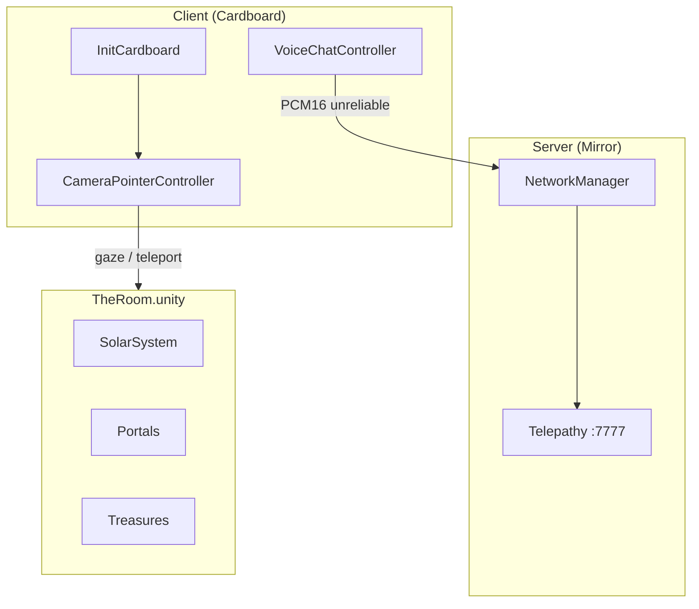

# meta-class-alpha

> **Languages:** English | [Português (BR)](README_pt.md)

Multiplayer virtual reality experience for **Google Cardboard**, where players explore an immersive room with a solar system, planets, and portals. The focus is **gaze-based** interaction and shared presence among networked participants.

## About the game

Players enter the **The Room** scene with a Cardboard headset and can:

- Look at and interact with objects in the environment
- Teleport to the surface of celestial bodies marked as teleportable
- Talk to other players in real time via voice chat
- Navigate through spherical and cylindrical portals in the scene

The experience combines spatial exploration, hands-free interaction (gaze only), and synchronous multiplayer.

## Concepts and technologies

| Concept | Implementation |
|---------|----------------|
| **Mobile VR** | [Google Cardboard XR Plugin](https://github.com/googlevr/cardboard-xr-plugin) (`InitCardboard`) |
| **Multiplayer** | [Mirror](https://mirror-networking.com/) with **Telepathy** transport (port `7777`) |
| **Gaze interaction** | `CameraPointerController` — raycast from camera, dwell click (~3 s) |
| **Voice chat** | `VoiceChatController` — microphone capture, PCM16 streaming via Mirror (unreliable channel) |
| **Local multiplayer testing** | [ParrelSync](https://github.com/VeriorPies/ParrelSync) — project clones in the Editor |
| **UI** | TextMesh Pro + gaze progress slider |

### Important tags

Defined in `ProjectSettings/TagManager.asset` and used by interaction logic:

| Tag | Purpose |
|-----|---------|
| `Interactive` | Objects that respond to `OnPointerEnter` / `OnPointerExit` |
| `Teleportable` | Surfaces the player can teleport to after completing gaze |
| `Planet` | Planetary object grouping (e.g. name shown in UI) |
| `Environment` | Static scenery, ignored by interaction |

### Gaze interaction flow

```
Camera (look direction)
    → Raycast
    → Object tagged Interactive / Teleportable / Player
    → OnPointerEnter (visual highlight via ObjectBasicController)
    → Dwell on target (~3 s, progress bar)
    → Click: action (teleport if Teleportable) or UI feedback
    → OnPointerExit when focus is lost
```

## Project architecture

```
meta-class-alpha/
├── Assets/
│   ├── Scenes/TheRoom.unity      # Main scene (only one in build)
│   ├── Scripts/                  # Game logic
│   ├── Prefabs/                  # Player, portals, treasures
│   ├── Models/                   # SolarSystem.fbx, avatar (Male_002)
│   ├── Materials/                # Skybox, sun, portals, UI
│   ├── XR/                       # Cardboard loaders and settings (Android)
│   ├── Mirror/                   # Networking library
│   ├── ParrelSync/               # Multiplayer testing in Editor
│   └── Plugins/Android/          # Gradle and manifest for Android builds
├── Packages/manifest.json        # UPM dependencies (Cardboard, etc.)
├── ProjectSettings/              # Player, XR, build, tags
├── BUILD_ANDROID.md              # APK build guide
└── extensions.list               # Recommended VS Code extensions
```

### Core components

| Script | Responsibility |
|--------|----------------|
| `InitCardboard` | Cardboard init, skybox, recentering, and app exit |
| `CameraPointerController` | Gaze, teleport, focus UI, and dwell click (`NetworkBehaviour`) |
| `CameraEditorController` | Mouse look in Editor (local player only) |
| `ObjectBasicController` | Gaze visual feedback (material swap) |
| `VoiceChatController` | Spatial voice capture and playback (`NetworkBehaviour`) |
| `SunLightController` | Point light following the Sun in the solar system |
| `UILogger` | On-screen interaction messages (TMP) |

### Networking (Mirror)

- **NetworkManager** in `TheRoom` scene, port **7777**, max **4** connections
- **Player prefab** (`Assets/Prefabs/Player.prefab`): camera, canvas, gaze, voice, and network identity
- Server starts automatically in builds (`autoStartServerBuild`)
- Client connects manually (`localhost` by default in Editor)

### Simplified diagram



## Requirements

| Tool | Version |
|------|---------|
| Unity | **6000.3.6f1** (Unity 6.3) |
| Target platform | Android (Cardboard) + Editor for development |
| IDE | VS Code, Rider, or Visual Studio |

Recommended Unity Hub modules: **Android Build Support** (SDK, NDK, OpenJDK).

## Getting started (developers)

### 1. Clone and open

```bash
git clone <repository-url>
cd meta-class-alpha
```

Open the folder in **Unity Hub** with editor **6000.3.6f1**.

### 2. Working scene

Open `Assets/Scenes/TheRoom.unity`. It is the only scene included in the build.

### 3. Test in Editor

1. Press **Play**
2. The Mirror server starts automatically on port `7777`
3. In the Editor, `CameraEditorController` lets you look around with the mouse (local player only)
4. To test **two players** on the same PC, use **ParrelSync → Clones Manager** and open a project clone

### 4. Test on Android device

See the full guide in **[BUILD_ANDROID.md](BUILD_ANDROID.md)**.

Summary: switch platform to Android, disable App Bundle if you want an APK, then **Build** or **Build And Run**.

### 5. Local network multiplayer

1. Note the IP of the machine hosting the server
2. On the client, set the address on `NetworkManager` (or via UI if exposed)
3. Ensure port **7777** is open in the firewall

## Prefab structure

| Prefab | Description |
|--------|-------------|
| `Player.prefab` | Networked player: VR camera, gaze, voice, HUD |
| `Sphere Portal.prefab` | Interactive spherical portal |
| `Cylinder Portal.prefab` | Interactive cylindrical portal |
| `Treasure.prefab` | Collectible / interactive object |

## VS Code extensions

Recommended list in `extensions.list`. To install on a new machine:

```bash
cat extensions.list | xargs -I {} code --install-extension {}
```

To update the list after installing new extensions:

```bash
code --list-extensions > extensions.list
```

Current extensions: C#, Unity Tools, Unity Debug, DocComment.

## Player settings (Android)

| Field | Value |
|-------|-------|
| Package Name | `com.BlackRocket.metaclassalpha` |
| Version | `0.1` (versionCode: 1) |
| Min API Level | 25 |
| Scripting Backend | IL2CPP |
| Architectures | ARMv7 + ARM64 |

## Additional documentation

- [BUILD_ANDROID.md](BUILD_ANDROID.md) — build and install APK ([PT](BUILD_ANDROID_pt.md))
- [Mirror Documentation](https://mirror-networking.com/docs/)
- [Cardboard XR Plugin](https://github.com/googlevr/cardboard-xr-plugin)
- [ParrelSync Wiki](https://github.com/VeriorPies/ParrelSync/wiki)

## License and credits

- **Company:** Black Rocket
- **Product:** meta-class-alpha
- Third-party libraries: Mirror, Google Cardboard XR, ParrelSync, TextMesh Pro
