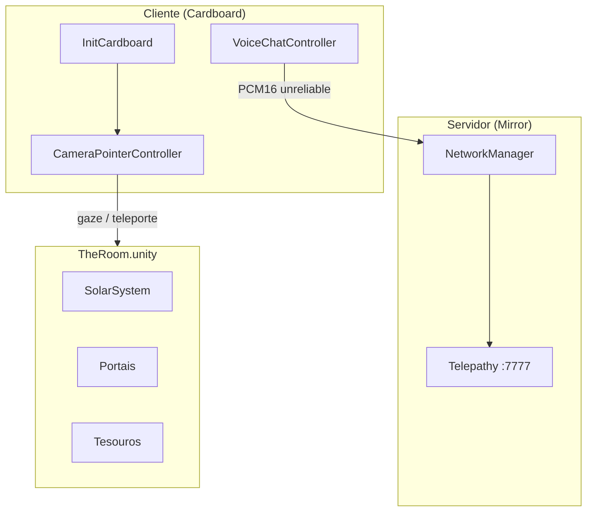

# meta-class-alpha

> **Idiomas:** [English](README.md) | Português (BR)

Experiência multiplayer em realidade virtual para **Google Cardboard**, onde jogadores exploram uma sala imersiva com sistema solar, planetas e portais. O foco é a interação por **olhar** (gaze) e a presença compartilhada entre participantes conectados em rede.

## Sobre o jogo

O jogador entra na cena **The Room** com um visor Cardboard e pode:

- Observar e interagir com objetos no ambiente
- Teleportar-se para a superfície de corpos celestes marcados como teleportáveis
- Conversar por voz com outros jogadores em tempo real
- Navegar por portais esféricos e cilíndricos no cenário

A experiência combina exploração espacial, interação sem mãos (apenas com o olhar) e multiplayer síncrono.

## Conceitos e tecnologias

| Conceito | Implementação |
|----------|---------------|
| **VR mobile** | [Google Cardboard XR Plugin](https://github.com/googlevr/cardboard-xr-plugin) (`InitCardboard`) |
| **Multiplayer** | [Mirror](https://mirror-networking.com/) com transporte **Telepathy** (porta `7777`) |
| **Interação por gaze** | `CameraPointerController` — raycast a partir da câmera, clique por permanência (~3 s) |
| **Voice chat** | `VoiceChatController` — captura de microfone, streaming PCM16 via Mirror (canal unreliable) |
| **Teste local multiplayer** | [ParrelSync](https://github.com/VeriorPies/ParrelSync) — clones do projeto no Editor |
| **UI** | TextMesh Pro + slider de progresso do gaze |

### Tags importantes

Definidas em `ProjectSettings/TagManager.asset` e usadas pela lógica de interação:

| Tag | Uso |
|-----|-----|
| `Interactive` | Objetos que respondem a `OnPointerEnter` / `OnPointerExit` |
| `Teleportable` | Superfícies para onde o jogador pode se teleportar ao completar o gaze |
| `Planet` | Agrupamento de objetos planetários (ex.: nome exibido na UI) |
| `Environment` | Cenário estático, ignorado na interação |

### Fluxo de interação (gaze)

```
Câmera (direção do olhar)
    → Raycast
    → Objeto com tag Interactive / Teleportable / Player
    → OnPointerEnter (destaque visual via ObjectBasicController)
    → Permanência no alvo (~3 s, barra de progresso)
    → Clique: ação (teleporte se Teleportable) ou feedback na UI
    → OnPointerExit ao sair do foco
```

## Arquitetura do projeto

```
meta-class-alpha/
├── Assets/
│   ├── Scenes/TheRoom.unity      # Cena principal (única no build)
│   ├── Scripts/                  # Lógica do jogo
│   ├── Prefabs/                  # Player, portais, tesouros
│   ├── Models/                   # SolarSystem.fbx, avatar (Male_002)
│   ├── Materials/                # Skybox, sol, portais, UI
│   ├── XR/                       # Loaders e settings do Cardboard (Android)
│   ├── Mirror/                   # Biblioteca de networking
│   ├── ParrelSync/               # Teste multiplayer no Editor
│   └── Plugins/Android/          # Gradle e manifest para build Android
├── Packages/manifest.json        # Dependências UPM (Cardboard, etc.)
├── ProjectSettings/              # Player, XR, build, tags
├── BUILD_ANDROID_pt.md           # Guia de build APK
└── extensions.list               # Extensões recomendadas do VS Code
```

### Componentes principais

| Script | Responsabilidade |
|--------|------------------|
| `InitCardboard` | Inicialização do Cardboard, skybox, recentralização e saída do app |
| `CameraPointerController` | Gaze, teleporte, UI de foco e clique por permanência (`NetworkBehaviour`) |
| `CameraEditorController` | Controle por mouse no Editor (apenas `isLocalPlayer`) |
| `ObjectBasicController` | Feedback visual de gaze (troca de material) |
| `VoiceChatController` | Captura e reprodução espacial de voz (`NetworkBehaviour`) |
| `SunLightController` | Luz pontual seguindo o Sol no sistema solar |
| `UILogger` | Mensagens de interação na tela (TMP) |

### Rede (Mirror)

- **NetworkManager** na cena `TheRoom`, porta **7777**, máximo **4** conexões
- **Player prefab** (`Assets/Prefabs/Player.prefab`): câmera, canvas, gaze, voz e identidade de rede
- Servidor inicia automaticamente em builds (`autoStartServerBuild`)
- Cliente conecta manualmente (host `localhost` por padrão no Editor)

### Diagrama simplificado



## Requisitos

| Ferramenta | Versão |
|------------|--------|
| Unity | **6000.3.6f1** (Unity 6.3) |
| Plataforma alvo | Android (Cardboard) + Editor para desenvolvimento |
| IDE | VS Code, Rider ou Visual Studio |

Módulos Unity recomendados no Hub: **Android Build Support** (SDK, NDK, OpenJDK).

## Começando (desenvolvedores)

### 1. Clonar e abrir

```bash
git clone <url-do-repositorio>
cd meta-class-alpha
```

Abra a pasta no **Unity Hub** com o editor **6000.3.6f1**.

### 2. Cena de trabalho

Abra `Assets/Scenes/TheRoom.unity`. É a única cena incluída no build.

### 3. Testar no Editor

1. Pressione **Play**
2. O servidor Mirror sobe automaticamente na porta `7777`
3. No Editor, `CameraEditorController` permite olhar ao redor com o mouse (somente jogador local)
4. Para testar **dois jogadores** no mesmo PC, use **ParrelSync → Clones Manager** e abra um clone do projeto

### 4. Testar em dispositivo Android

Siga o guia completo em **[BUILD_ANDROID_pt.md](BUILD_ANDROID_pt.md)**.

Resumo: troque a plataforma para Android, desative App Bundle se quiser APK, e faça **Build** ou **Build And Run**.

### 5. Multiplayer em rede local

1. Anote o IP da máquina que hospeda o servidor
2. No cliente, configure o endereço no `NetworkManager` (ou via UI, se exposta)
3. Garanta que a porta **7777** esteja liberada no firewall

## Estrutura de prefabs

| Prefab | Descrição |
|--------|-----------|
| `Player.prefab` | Jogador em rede: câmera VR, gaze, voz, HUD |
| `Sphere Portal.prefab` | Portal esférico interativo |
| `Cylinder Portal.prefab` | Portal cilíndrico interativo |
| `Treasure.prefab` | Objeto colecionável/interativo |

## Extensões VS Code

Lista recomendada em `extensions.list`. Para instalar em uma máquina nova:

```bash
cat extensions.list | xargs -I {} code --install-extension {}
```

Para atualizar a lista após instalar novas extensões:

```bash
code --list-extensions > extensions.list
```

Extensões atuais: C#, Unity Tools, Unity Debug, DocComment.

## Configuração do player (Android)

| Campo | Valor |
|-------|-------|
| Package Name | `com.BlackRocket.metaclassalpha` |
| Versão | `0.1` (versionCode: 1) |
| Min API Level | 25 |
| Scripting Backend | IL2CPP |
| Arquiteturas | ARMv7 + ARM64 |

## Documentação adicional

- [BUILD_ANDROID_pt.md](BUILD_ANDROID_pt.md) — gerar e instalar APK ([EN](BUILD_ANDROID.md))
- [Mirror Documentation](https://mirror-networking.com/docs/)
- [Cardboard XR Plugin](https://github.com/googlevr/cardboard-xr-plugin)
- [ParrelSync Wiki](https://github.com/VeriorPies/ParrelSync/wiki)

## Licença e créditos

- **Empresa:** Black Rocket
- **Produto:** meta-class-alpha
- Bibliotecas de terceiros: Mirror, Google Cardboard XR, ParrelSync, TextMesh Pro
